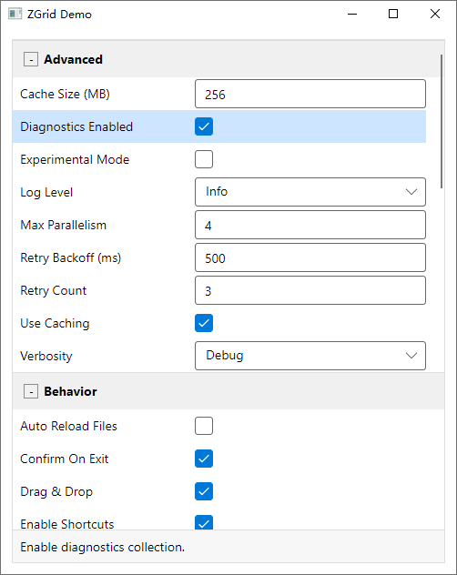

# ZGrid

基于 .NET 9 与 Avalonia 11 的 PropertyGrid 控件与演示应用。

- 支持平台：Windows / macOS / Linux
- 组件库：ZGrid（命名空间 `Z`，控件类型 `Z.ZGrid`）
- 演示程序：ZGrid.Demo

## 你能得到什么
- 自动按 [Category] 分组显示对象属性
- 支持 [DisplayName]、[Description]（用于标题与说明面板）
- 基础编辑器：Text / Bool / Enum
- 扩展示例编辑器：
  - ListPicker（从外部集合选择，特性 `[ListPickerEditor]`）
  - Cascader（三级级联，特性 `[CascaderEditor]` + `ITreeNode` 数据）
- 纯 MVVM：使用 CommunityToolkit.Mvvm 生成命令与属性

## 截图



## 快速上手
1) 引用组件库项目 ZGrid（或将其加入你的解决方案并添加项目引用）。
2) 在视图中引入命名空间并放置控件：
```xml
<Window
    xmlns="https://github.com/avaloniaui"
    xmlns:x="http://schemas.microsoft.com/winfx/2006/xaml"
    xmlns:z="clr-namespace:Z;assembly=ZGrid">
  <z:ZGrid SelectedObject="{Binding SelectedObject}" />
</Window>
```
3) 在 ViewModel 中提供一个对象实例：
```csharp
using CommunityToolkit.Mvvm.ComponentModel;

public partial class MainWindowViewModel : ObservableObject
{
    [ObservableProperty]
    private object? selectedObject = new MySettings();
}
```
4) 在模型上通过特性描述元数据与可选编辑器：
```csharp
using System.ComponentModel;
using Z;

public class MySettings
{
    [Category("General"), DisplayName("User Name"), Description("Shown across the app.")]
    public string? UserName { get; set; }

    [Category("General")]
    public bool EnableFeature { get; set; }

    [Category("Advanced")]
    public LogLevel LogLevel { get; set; }

    // ListPicker 示例
    [Browsable(false)]
    public List<Person> PeopleSource { get; } = new();

    [Category("Misc"), DisplayName("Owner"), ListPickerEditor(nameof(PeopleSource))]
    public Person? Owner { get; set; }

    // Cascader 示例
    [Browsable(false)]
    public List<CascaderNode> CascaderSource { get; } = new();

    [Category("Misc"), DisplayName("Cascader Value"), CascaderEditor(nameof(CascaderSource))]
    public string CascaderValue { get; set; } = string.Empty;
}
```

## 构建运行

```bash
# 还原 & 构建
dotnet restore
dotnet build

# 运行 Demo
dotnet run --project ZGrid.Demo/ZGrid.Demo.csproj
```


## 许可
MIT，详见 LICENSE。

> 内容由 AI 生成，请仔细甄别。
