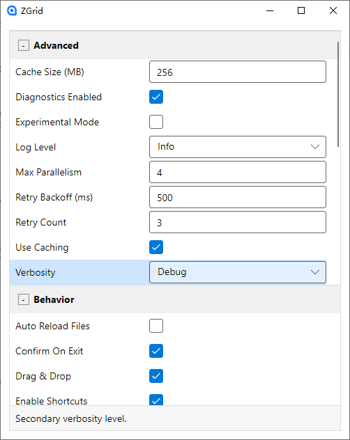

# ZGrid

一个基于 .NET 9 和 Avalonia 的跨平台桌面示例应用，用于展示一个简单而实用的 PropertyGrid（属性面板）控件。该控件按分类分组显示对象属性，提供基础编辑器，并采用清晰的 MVVM 结构，方便在你的项目中复用。

- 支持平台：Windows / macOS / Linux
- 技术栈：.NET 9、Avalonia 11.2、CommunityToolkit.Mvvm

## 功能特性
- MVVM 优先，无界面逻辑堆叠在 code-behind
- 基于特性（Attribute）的分组与元数据支持：
  - [Category]、[DisplayName]、[Description]
- 内置基础编辑器（当前）：
  - Text：字符串及其他非常量布尔/枚举的类型（以字符串形式编辑）
  - Bool：复选框
  - Enum：下拉选择
- 组别折叠/展开，指令驱动
- 选中行联动底部“说明面板”，自动展示对应属性的描述
- 易于定制的样式与模板（Fluent 风格）

## 截图



## 快速开始
### 前置条件
- .NET SDK 9.0+

### 构建与运行
- 还原依赖：`dotnet restore`
- 构建：`dotnet build`
- 运行：`dotnet run --project ZGrid/ZGrid.csproj`

## 项目结构
- ZGrid/
  - Controls/
    - PropertyGrid.axaml, PropertyGrid.axaml.cs ―― 可复用的属性面板控件
  - Models/
    - MySettings.cs ―― 示例数据模型（带注解）
    - PropertyGridModels.cs ―― 控件所需模型、转换器、编辑器类型等
  - Views/
    - MainWindow.axaml ―― 承载 PropertyGrid 的窗口
  - ViewModels/
    - MainWindowViewModel.cs ―― 提供 SelectedObject 数据源

## PropertyGrid 控件说明
PropertyGrid 以两列布局显示属性：左侧为名称（DisplayName），右侧为编辑器；按 Category 进行分组。

### 关键属性（对外 API）
- SelectedObject (object?)：要展示和编辑的对象
- SelectedEntry (PropertyEntry?)：当前选中的属性条目（支持绑定）

### 数据模型
- PropertyEntry：包装 PropertyDescriptor，暴露 DisplayName、Description、Category、EditorKind，以及编辑值（StringValue、BoolValue、EnumValue）
- CategoryGroup：Name、Items、IsExpanded
- 转换器：EditorKindEqualsConverter、NotConverter、BoolToGlyphConverter

### 支持的编辑器（当前）
- Text：TextBox 绑定 StringValue
- Bool：CheckBox 绑定 BoolValue
- Enum：ComboBox 绑定 EnumValues/EnumValue

说明：为保持示例简洁，日期、多选等编辑器已移除。

### 使用示例
XAML（放入你的视图中）：
```xml
<controls:PropertyGrid SelectedObject="{Binding SelectedObject}" />
```

ViewModel（提供一个对象实例）：
```csharp
public partial class MainWindowViewModel : ViewModelBase
{
    [ObservableProperty]
    private object? selectedObject = new MySettings();
}
```

模型（添加注解）：
```csharp
public class MySettings
{
    [Category("General"), DisplayName("User Name"), Description("Shown across the app.")]
    public string? UserName { get; set; } = Environment.UserName;

    [Category("General"), DisplayName("Enable Feature"), Description("Toggle a flag.")]
    public bool EnableFeature { get; set; } = true;

    [Category("Advanced"), DisplayName("Log Level"), Description("Select log level.")]
    public LogLevel LogLevel { get; set; } = LogLevel.Info;
}
```

## 主题与样式
- 折叠按钮：样式类 `collapse-btn`
- 行的悬停/选中：在 PropertyGrid.axaml 的 ListBoxItem 样式中定义
- 可根据需要替换颜色、边框、模板以符合你的产品风格

## 规划（Roadmap）
- 可选编辑器（日期、数值、多选等）的可插拔扩展
- 校验与错误展示
- 属性搜索/过滤

## 参与贡献
- Fork 仓库
- 基于功能建立分支
- 建议使用清晰的提交信息
- 提交 PR 时请附上改动说明；涉及 UI 的改动请附上前后截图

较大范围的改动，建议先提 Issue 进行讨论。

## 许可协议
本项目使用 MIT 许可证发布。你可以自由地使用、复制、修改、合并、发布、再许可及/或销售本软件的副本，但需随软件一同包含版权和许可声明。详情参见 [LICENSE](LICENSE)。